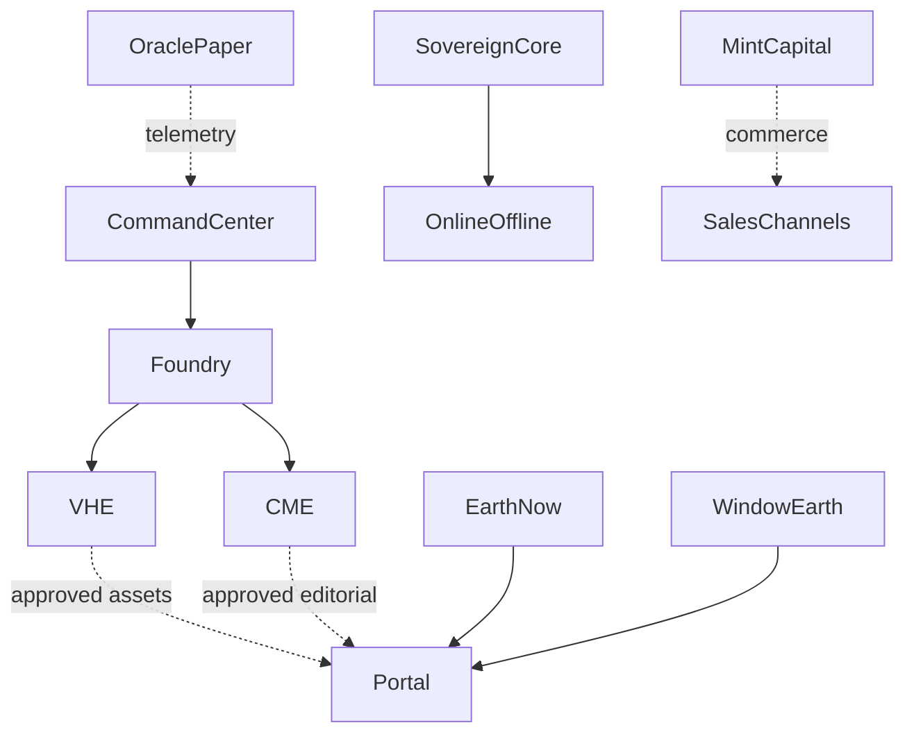

# Ecosystem Atlas — verified baseline, 2026-10-07

Discovery via connected GitHub: 26 accessible repositories. Canonical Foundry registry: 20 systems. Existence is NOT uptime, adoption or revenue.

## Repository inventory
- [Hemp-Token](https://github.com/godsun108/Hemp-Token) — existence verified; deployment/revenue not verified
- [victory-trust-registry](https://github.com/godsun108/victory-trust-registry) — existence verified; deployment/revenue not verified
- [sacredchainx](https://github.com/godsun108/sacredchainx) — existence verified; deployment/revenue not verified
- [ryln-ai](https://github.com/godsun108/ryln-ai) — existence verified; deployment/revenue not verified
- [victorychain_stack](https://github.com/godsun108/victorychain_stack) — existence verified; deployment/revenue not verified
- [-oracle-options-lab](https://github.com/godsun108/-oracle-options-lab) — existence verified; deployment/revenue not verified
- [turbo-foundry](https://github.com/godsun108/turbo-foundry) — existence verified; deployment/revenue not verified
- [earth-now](https://github.com/godsun108/earth-now) — existence verified; deployment/revenue not verified
- [window-earth](https://github.com/godsun108/window-earth) — existence verified; deployment/revenue not verified
- [edge-intelligence](https://github.com/godsun108/edge-intelligence) — existence verified; deployment/revenue not verified
- [Mint](https://github.com/godsun108/Mint) — existence verified; deployment/revenue not verified
- [Mint-capital-engine](https://github.com/godsun108/Mint-capital-engine) — existence verified; deployment/revenue not verified
- [Seldon](https://github.com/godsun108/Seldon) — existence verified; deployment/revenue not verified
- [soul-key](https://github.com/godsun108/soul-key) — existence verified; deployment/revenue not verified
- [The-portal](https://github.com/godsun108/The-portal) — existence verified; deployment/revenue not verified
- [Sovereign-Core](https://github.com/godsun108/Sovereign-Core) — existence verified; deployment/revenue not verified
- [Sovereign-Online](https://github.com/godsun108/Sovereign-Online) — existence verified; deployment/revenue not verified
- [Sovereign-Offline](https://github.com/godsun108/Sovereign-Offline) — existence verified; deployment/revenue not verified
- [Command-center](https://github.com/godsun108/Command-center) — existence verified; deployment/revenue not verified
- [virtual-human-engine](https://github.com/godsun108/virtual-human-engine) — existence verified; deployment/revenue not verified
- [oracle-execution](https://github.com/godsun108/oracle-execution) — existence verified; deployment/revenue not verified
- [dreams-to-reality](https://github.com/godsun108/dreams-to-reality) — existence verified; deployment/revenue not verified
- [alchemy-kitchen](https://github.com/godsun108/alchemy-kitchen) — existence verified; deployment/revenue not verified
- [civic-media-engine](https://github.com/godsun108/civic-media-engine) — existence verified; deployment/revenue not verified
- [civic-ledger](https://github.com/godsun108/civic-ledger) — existence verified; deployment/revenue not verified
- [poolside-estate](https://github.com/godsun108/poolside-estate) — existence verified; deployment/revenue not verified

## Evidence and exceptions
- [G36 workflow](https://github.com/godsun108/virtual-human-engine/actions/runs/37697109415): branch feature/mechanical-obsessions-v2, commit 930028c5d00455dc114b27163927e9c9e13b3115; attempts 1 and 2 FAILED without assigned runner or executed steps; no artifacts. Certification and human approval gates remain CLOSED. Root cause undetermined.
- [Oracle Execution](https://github.com/godsun108/oracle-execution): paper-only prototype, not verified profitability.
- [Mint](https://github.com/godsun108/Mint): empty placeholder; [Mint-capital-engine](https://github.com/godsun108/Mint-capital-engine) separate source, revenue unverified.
- [Foundry registry](https://github.com/godsun108/turbo-foundry/blob/main/ECOSYSTEM_STATUS.md): registered systems, not uptime.
- [Command Center](https://github.com/godsun108/Command-center): local server documented; remote health unverified.

## Intended architecture (not proven live integrations)

## Priorities
1. Resolve G36 runner/startup issue or generate independent reproducible native certification evidence; do not promote without passing review.
2. Check actual sales/orders/payouts in provider records, not code or product listings.
3. Probe deployments with timestamps; preserve evidence.
4. Add machine-readable status and discovery to Foundry; surface in Command Center.
5. Review and preserve legacy/empty repos before any consolidation.

Safety: no credentials, financial transactions, spending, or commercial publication changed without explicit approval.
